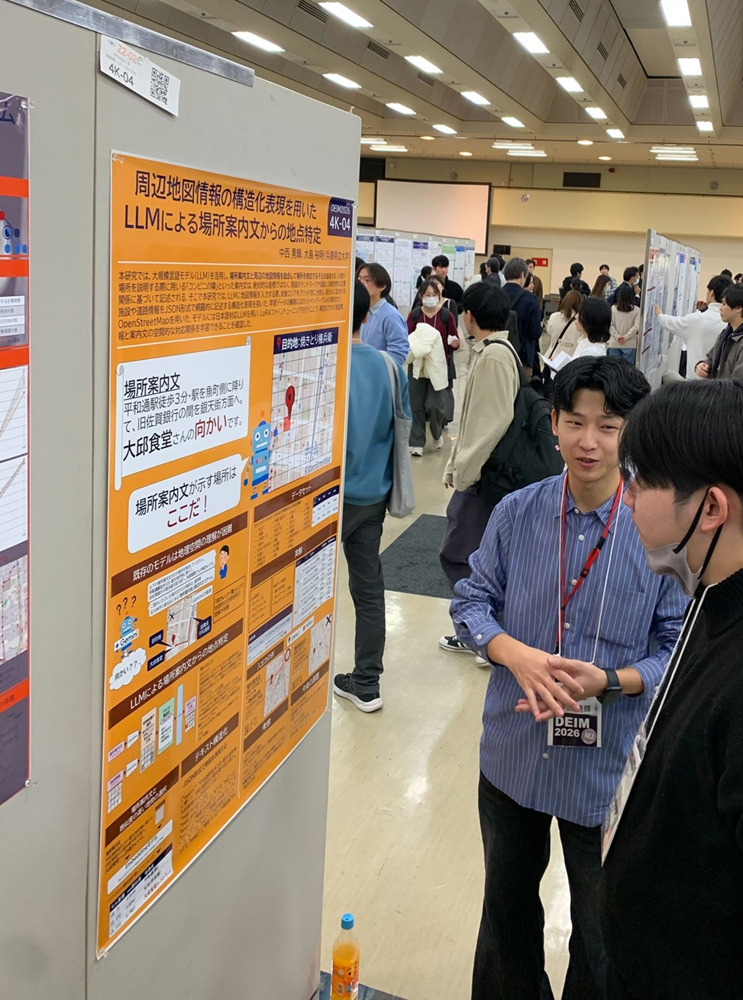
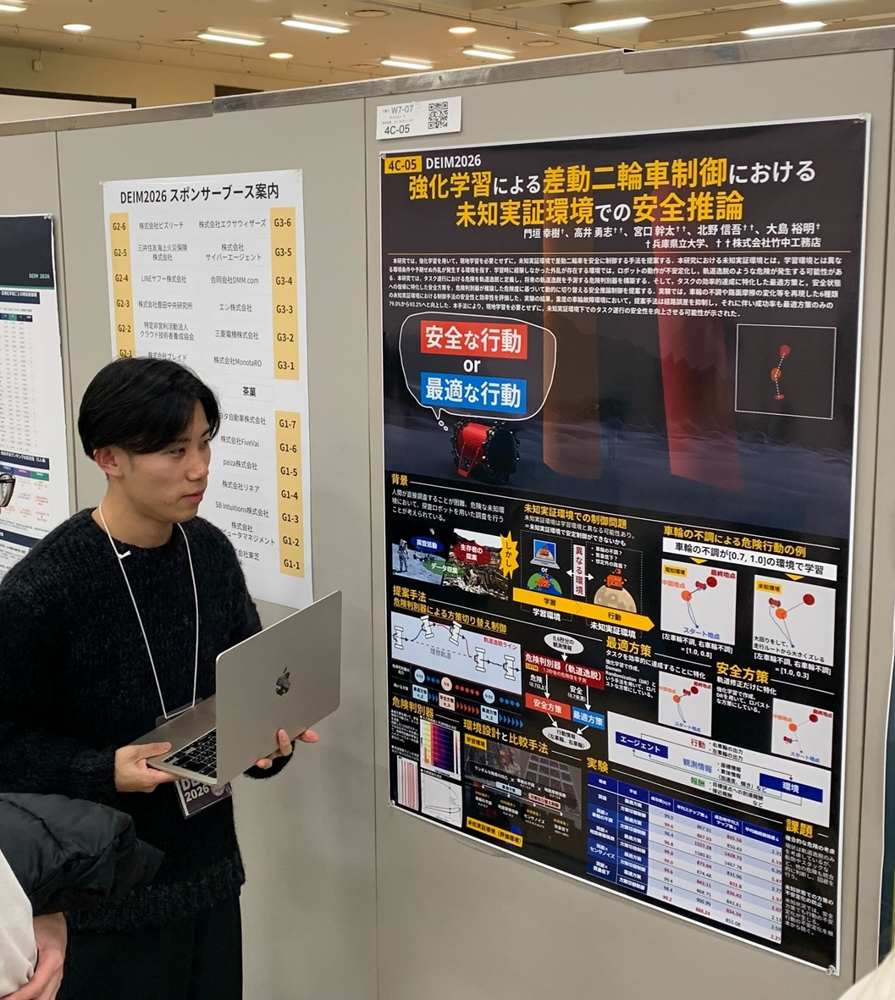

#### 日時：2026 年 2 月 28 日（土）～ 3 月 5 日（木）

#### 場所：Zoom と 神戸国際会議場・展示場

大島研究室のメンバーが DEIM2026 で発表を行いました。

- [1] ファム フーロン, 三林 亮太, 莊司 慶行, 加藤 誠, 山本 岳洋, 山本 祐輔, 大島 裕明: 「事前学習済みBERTモデル検索タスクのための評価データセット」, 日本データベース学会, 第 18 回データ工学と情報マネジメントに関するフォーラム (DEIM Forum 2026), 2026 年 3 月.
- [2] 橋口 友哉, 黒木 空翔, 大島 裕明: 「LLMによる多段階プロンプト最適化を用いた動機づけ面接カウンセリングチャットボットの構築」, 日本データベース学会, 第 18 回データ工学と情報マネジメントに関するフォーラム (DEIM Forum 2026), 2026 年 3 月.
- [3] 桑田 若菜, 三林 亮太, 谷 雅德, 大島 裕明: 「DPOを用いた人間の選好フィードバックに基づく手書き文字生成」, 日本データベース学会, 第 18 回データ工学と情報マネジメントに関するフォーラム (DEIM Forum 2026), 2026 年 3 月.
- [4] 中西 勇輝, 大島 裕明: 「周辺地図情報の構造化表現を用いたLLMによる場所案内文からの地点特定」, 日本データベース学会, 第 18 回データ工学と情報マネジメントに関するフォーラム (DEIM Forum 2026), 2026 年 3 月.
- [5] 中山 裕紀, 大島 裕明: 「不動産情報探索VRインタフェースにおける属性分布可視化」, 日本データベース学会, 第 18 回データ工学と情報マネジメントに関するフォーラム (DEIM Forum 2026), 2026 年 3 月.
- [6] 門垣 幸樹, 高井 勇志, 宮口 幹太, 北野 信吾, 大島 裕明: 「強化学習による差動二輪車制御における未知実証環境での安全推論」, 日本データベース学会, 第 18 回データ工学と情報マネジメントに関するフォーラム (DEIM Forum 2026), 2026 年 3 月.
- [7] 木下 真帆, 桑田 若菜, 三林 亮太, 大島 裕明: 「画像インペインティングを用いた展示物外観の意外性分析」, 日本データベース学会, 第 18 回データ工学と情報マネジメントに関するフォーラム (DEIM Forum 2026), 2026 年 3 月.
- [8] 内藤 洋輝, 桑田 若菜, 大島 裕明: 「衛星画像と異種地理情報の統合に基づくU-Netによる樹冠高推定」, 日本データベース学会, 第 18 回データ工学と情報マネジメントに関するフォーラム (DEIM Forum 2026), 2026 年 3 月.
- [9] 中村 嵩, 大島 裕明: 「効果音の印象記述を介した俳句の情景に沿った効果音付き読み上げ音声の生成」, 日本データベース学会, 第 18 回データ工学と情報マネジメントに関するフォーラム (DEIM Forum 2026), 2026 年 3 月.
- [10] 松本 美風, 中西 勇輝, 橋口 友哉, 大島 裕明: 「空間情報の抽象化に基づくLLM活用による道案内の目印地物特定と説明文生成」, 日本データベース学会, 第 18 回データ工学と情報マネジメントに関するフォーラム (DEIM Forum 2026), 2026 年 3 月.

また、橋口 友哉さん、中西 勇輝さん、中山 裕紀さん、門垣 幸樹さん、木下 真帆さん、内藤 洋輝さんの 6 名が学生プレゼンテーション賞を受賞しました！
おめでとうございます！

[DEIM2026　公式サイト](https://pub.confit.atlas.jp/ja/event/deim2026)
