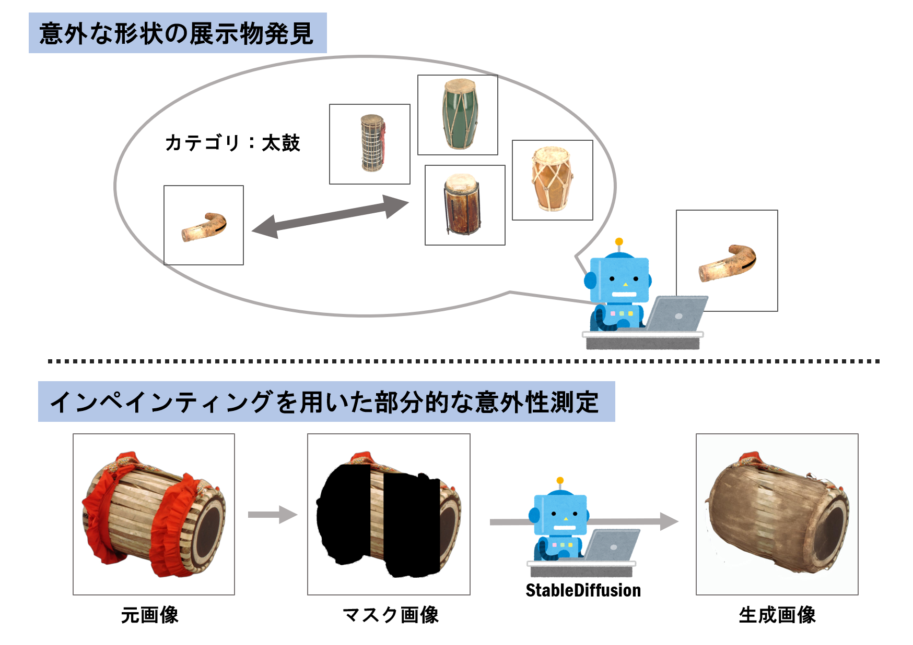

## AIを用いた意外性の分析

私たちは、モノや出来事についての事柄が自分の予想と異なったときに、思いがけない驚きを感じることがあります。このような感覚は**意外性**と呼ばれ、人の注意を引いたり、記憶に残りやすくしたりする重要な要素として知られています。私は、この意外性をAIによって定量的に測ることを目指して研究を行っています。
本研究では、意外性を**ある対象が一般的な特徴や期待からどの程度外れているか**として捉えます。意外性はいくつかの側面から捉えることができますが、それらに対してどのような手法が有効かを検討しており、今回は二つの手法を紹介します。  
研究で主に使用しているのは[国立民族学博物館](https://www.minpaku.ac.jp/)（通称みんぱく）という博物館の展示物データセットです。

一つ目の手法では、画像変換や特徴量抽出、外れ値検出を組み合わせ、**意外な形状の展示物**を発見する方法を検証しました[1]。画像から抽出した特徴量に基づいて同一カテゴリ内の類似性を評価し、他と大きく異なる対象を外れ値として検出します。このような対象を、形状に基づく意外性が高いものとします。実験では、異なる形状を持つ展示物が検出され、人の感覚とも一定の対応を示す結果が得られました。

もう一つの手法では、画像生成モデルによるインペインティングを用いて、展示物の**部分的な模様や装飾の意外性**を分析します[2]。一般的な外観を学習したモデルに画像の一部を補完させると、よく見られる特徴は自然に再現される一方で、特徴的な部分はうまく再現されません。このとき、元画像との差が大きい領域ほど、その部分はモデルの期待から外れており、視覚的に意外であると考えられます。本研究ではこの差を知覚的類似度指標（LPIPS）で数値化し、人の感じる意外性との関係を検討しています。現段階での実験の結果、典型的な展示物では画像との差が小さく、特徴的な装飾を持つ対象では画像との差が大きくなる傾向が確認されています。

今後は、形状や見た目だけでなく意味や文化的背景なども含め、今よりもさまざまな観点から意外性を測る方法の検討を課題としています。

## 論文
[1] M. Kinoshita et al.: "Measuring Shape Unexpectedness of Exhibits based on Similarity and Outlier Detection", In Proceedings of the 27th Information Integration and Web Intelligence (iiWAS 2025), pp.383-389, 2025.
  [[Paper]](https://doi.org/10.1007/978-3-032-11976-6_29)

[2] 木下真帆, 桑田若菜, 大島裕明: 「画像インペインティングを用いた展示物外観の意外性分析」, 第18回データ工学と情報マネジメントに関するフォーラム（DEIM 2026）, 6H-03, 2026.
  [[Paper]](https://pub.confit.atlas.jp/ja/event/deim2026/presentation/6H-03)