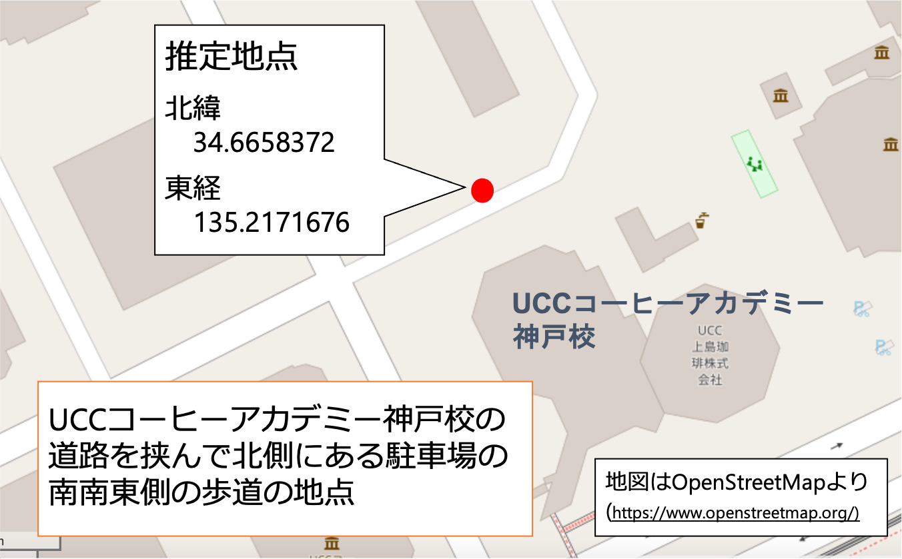

## 場所の説明文から、その場所の緯度経度を推定するシステム

<!-- 文で研究紹介 -->
ある場所を説明する文章から、その場所の緯度経度を推定する。[OpenStreetMap](https://www.openstreetmap.org/)から地理情報を取得し、説明文に応じた処理をすることで場所の推定を行う。

<!-- コレ使ったらね！こんなことが嬉しいよ！ -->
言葉を使って、現在地を説明しなければならない状況がある。例えば、交通事故に遭ったとき、警察や保険会社に電話をし、事故が発生した場所を伝えなければならない。言葉による説明から場所を特定するためには、聞き手に知識やスキルが必要である。聞き手の能力によって、推定の正確さに差が出ることもあるだろう。このシステムは、聞き手に代わって場所を推定し、聞き手の能力差によって生じる問題を解決する。

