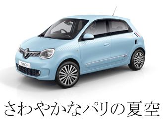

## 連想表現を用い、商品の魅力を引き出す同時に消費者に新奇さを与えるキャッチコピー生成システム

ポスターの広告では、短い文案で商品のイメージをきちんと伝える同時に、一瞬で興味をもたらす。その理由は、使用された語は商品のドメインと異なっても、商品と同じ特徴を持つことである。例えば、スニーカーの広告文の「しなやかな雪豹」、防視機能付きカーテンの広告文の「透明な秘密」がある。このようなロジカルと想像力を同時に求める課題では、人にとっても簡単にできるわけではない。

連想キャッチコピー生成システムを利用し、商品の広告や陳列台のデザイン、イラスト撮影にの支援が期待できる。

<iframe width="560" height="315" src="https://www.youtube.com/embed/cFUPU7cqO7Q" title="YouTube video player" frameborder="0" allow="accelerometer; autoplay; clipboard-write; encrypted-media; gyroscope; picture-in-picture" allowfullscreen></iframe>

