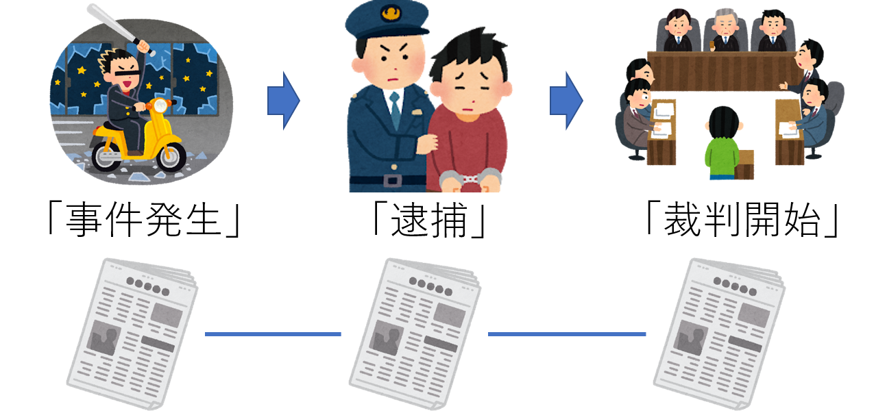

## ブックマークした記事を自動で続報順につなげてグラフ化する検索インタフェース

<!-- 文で研究紹介 -->
記事アーカイブで検索を行いブックマークした記事集合の中で、どの記事がどの記事の続報かを自動で判断してグラフ化します。

<!-- コレ使ったらね！こんなことが嬉しいよ！ -->
記事アーカイブは新聞記事などを数十年間にわたって保存したものです。記事アーカイブは小中学校のまとめ学習で自分の気になるトピックを調べる際などに用いられます。しかし、従来のWeb検索画面のようなインタフェースは検索とまとめを行うのに不親切であることがあります。例えば、検索を進めていくと最初にブックマークした記事の内容や記事間の関係性を忘れることがあります。一度読んだ記事を再度読み返して内容を把握するのは面倒な作業です。

そこで、ブックマークした記事を自動で続報順につなげてグラフ化する検索インタフェースを提案しています。新聞記事は出来事に対し少しずつ新情報を報道します。従来のインタフェースではユーザは記事同士の続報関係を記憶にとどめたまま検索を行わなければなりませんが、提案するインタフェースは自動で記事を続報順に整理してグラフ化します。そのため、ユーザは視覚的に現在の検索状態を把握でき、まとめの際もブックマーク記事をいちから整理するという手間が省けます。

まるで記事アーカイブという入り組んだ情報の洞窟で、ブックマーク記事が自分の欲しい情報に向かって自動で道を切り開いて（マッピングして）いくといったものになります。

+ 松本 直彰, 湯本 高行, 山本 岳洋, 大島 裕明: 「ニュースアーカイブ探索のための記事間の関係抽出とその可視化」, 電子情報通信学会, 第13回データ工学と情報マネジメントに関するフォーラム (DEIM Forum 2021), F25-3, 2021年3月.

<iframe width="560" height="315" src="https://www.youtube.com/embed/cve4ufy9TRc" title="YouTube video player" frameborder="0" allow="accelerometer; autoplay; clipboard-write; encrypted-media; gyroscope; picture-in-picture" allowfullscreen></iframe>