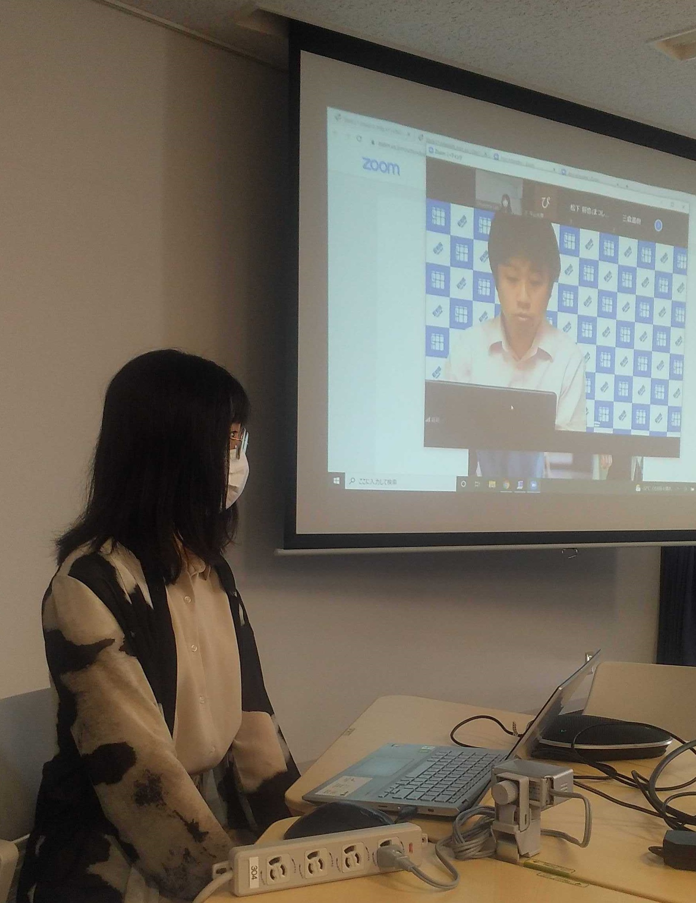
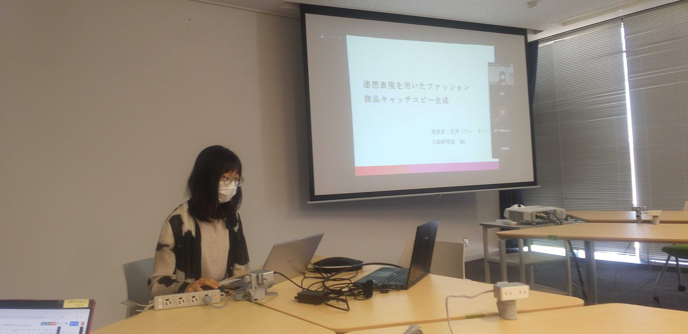
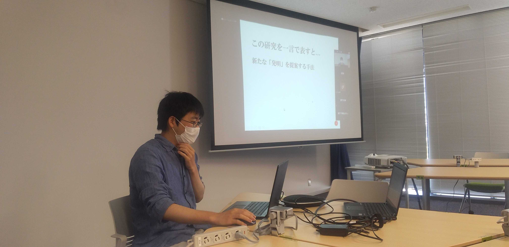
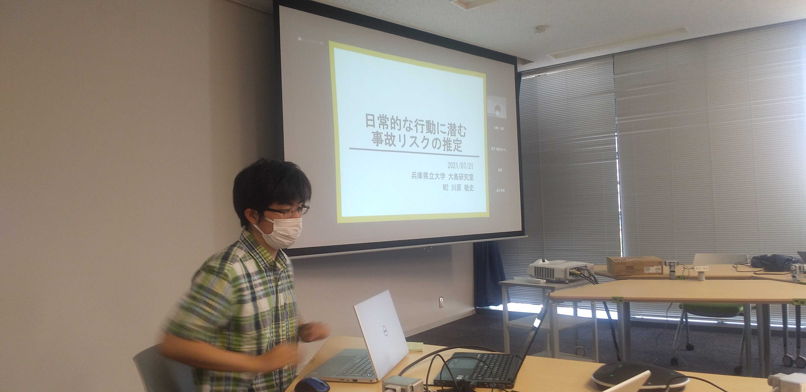
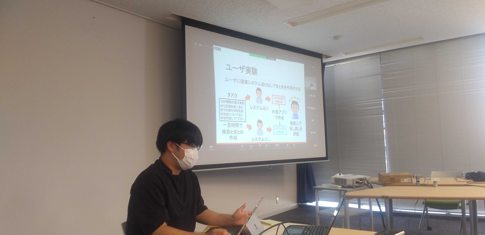
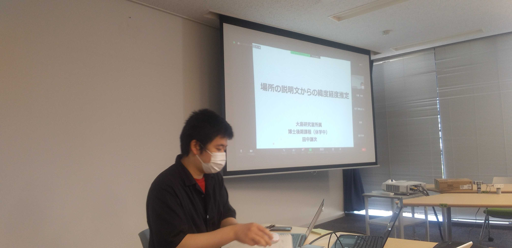

<!--  -->

#### 日時：2021年7月21日（水）
#### 場所：兵庫県立大学神戸情報科学キャンパス、Zoom

上記日程にて、兵庫県立大学大島研究室、青山学院大学Dürst研究室で合同研究会を行いました。

大島研究室6名、青山学院大学Dürst研究室の莊司慶行先生と6名の学生の合計13名で発表し合いました。
M1、M2共に、活発で有意義な議論を行えました。
夜は、Discordにて、Among Usとお絵描き伝言ゲームを行いました。
お絵描き伝言ゲームは、いつしても珍図画が生まれて、非常に楽しいです。

青山学院大学Dürst研究室の皆様、ありがとうございました。

<!--  -->
#### 各研究室・先生方のホームページ
[Dürst研究室のHP](https://moo.sw.it.aoyama.ac.jp) 
  
  

<!-- 1. 論文採録バージョン -->
<!-- [第一著者]さんの論文が「[学会フルネーム]」に採録されました。 -->

<!-- [公式Webページ](学会公式ページTopのURL) -->

<!-- 書誌情報。書式はPublicationsを参考。変にコードブロックとかで囲まなくてOK -->

<!-- [年月日]に発表予定 -->

<!-- 2. 論文発表済みバージョン -->
<!-- [第一著者]さんが「[学会フルネーム]」で発表しました。 -->

<!-- [公式Webページ](学会公式ページTopのURL) -->

<!-- 書誌情報。書式はPublicationsを参考。変にコードブロックとかで囲まなくてOK -->

<!-- 3. 論文受賞バージョン -->
<!-- [第一著者]さんの論文が「[学会フルネーム]」で「[受賞名]」を受賞しました -->

<!-- [公式Webページ](学会公式ページTopのURL) -->

<!-- 書誌情報。書式はPublicationsを参考。変にコードブロックとかで囲まなくてOK -->

<!-- 同学会複数名の場合は並べて良い感じにして -->