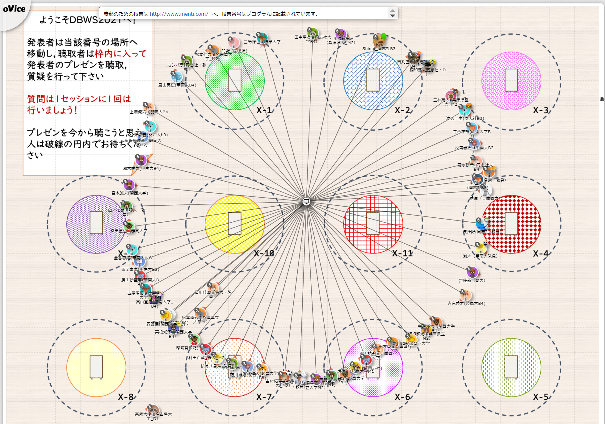
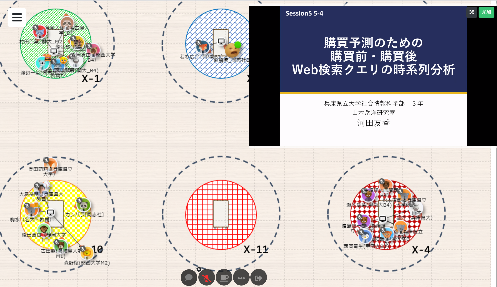
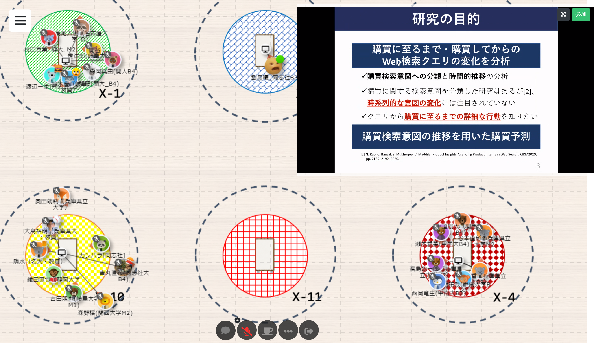
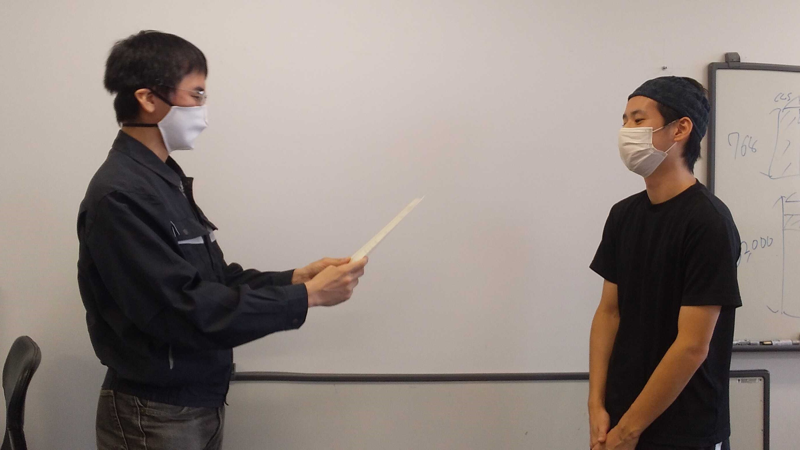
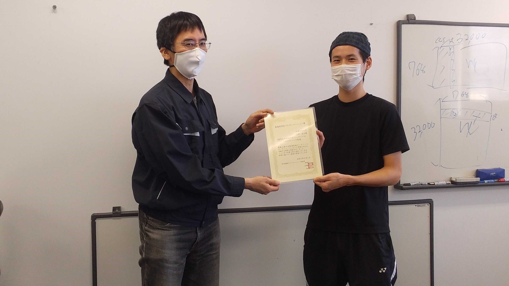
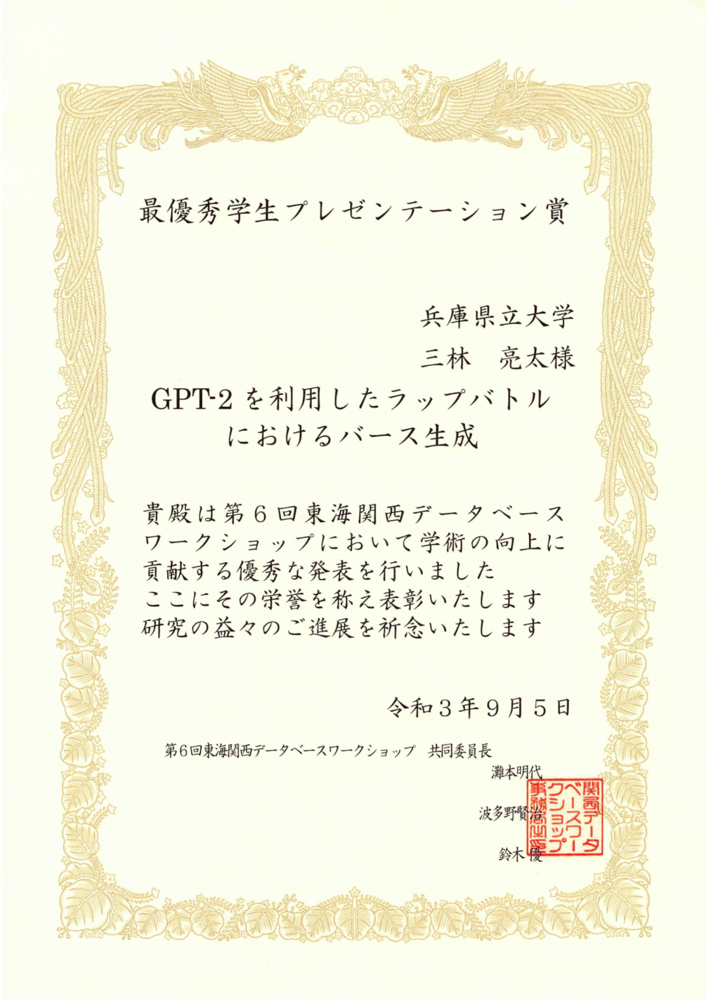

#### 日時：2021年9月5日（日）～9月6日（月）
#### 場所：oVice

上記日程にて、大島研のメンバーが東海関西データベースワークショップ 2021に参加しました。

たくさんのコメントをいただいたり、色んな研究を知ることができたりと、とても充実した2日間でした。

 

また、三林亮太さんが最優秀学生プレゼンテーション賞を受賞しました。
- 三林亮太, 最優秀学生プレゼンテーション賞, GPT-2を利用したラップバトルにおけるバース生成, 第6回東海関西データベースワークショップ, 2021年9月5日

皆さん、お疲れ様でした！

<!--  -->
[公式webページ](https://sites.google.com/db.info.gifu-u.ac.jp/dbws2021/) 
  
  

<!-- 1. 論文採録バージョン -->
<!-- [第一著者]さんの論文が「[学会フルネーム]」に採録されました。 -->

<!-- [公式Webページ](学会公式ページTopのURL) -->

<!-- 書誌情報。書式はPublicationsを参考。変にコードブロックとかで囲まなくてOK -->

<!-- [年月日]に発表予定 -->

<!-- 2. 論文発表済みバージョン -->
<!-- [第一著者]さんが「[学会フルネーム]」で発表しました。 -->

<!-- [公式Webページ](学会公式ページTopのURL) -->

<!-- 書誌情報。書式はPublicationsを参考。変にコードブロックとかで囲まなくてOK -->

<!-- 3. 論文受賞バージョン -->
<!-- [第一著者]さんの論文が「[学会フルネーム]」で「[受賞名]」を受賞しました -->

<!-- [公式Webページ](学会公式ページTopのURL) -->

<!-- 書誌情報。書式はPublicationsを参考。変にコードブロックとかで囲まなくてOK -->

<!-- 同学会複数名の場合は並べて良い感じにして -->